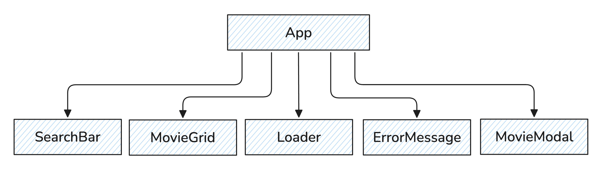

# 03-react-movies


Створено репозиторій 03-react-movies
При здачі роботи надаються два посилання: на вихідні файли (репозиторій) та на робочу сторінку завдання, розгорнуту на [Vercel](https://vercel.com/).
Проєкт створено за допомогою [Vite](https://vitejs.dev/).
Під час запуску коду в консолі не повинно бути помилок або попереджень.
Для кожного компонента у папці src/components має бути окрема папка, яка містить файл самого React компонента та файл його стилів. Назва папки, файлу компонента (з розширенням .tsx) та файлу стилів (перед .module.css) однакова і відповідає назвам, вказаним у завданнях (якщо вони були).


У кожній папці компонента мають бути:

файл компонента з розширенням .tsx (наприклад, App.tsx);
файл стилів, назва якого закінчується на .module.css, з такою самою назвою (наприклад, App.module.css).


Для експорту компонентів використовується експорт за замовчуванням (export default).
Загальні типи, які використовуються в кількох компонентах, винесені в окремий файл (src/types/movie.ts). Типи та інтерфейси, які стосуються лише одного компонента, оголошені безпосередньо у файлі цього компонента.
Для типізації пропсів компонентів використовується interface.
Інтерфейс для пропсів компонента називається за схемою: Ім\'яКомпонентаProps (наприклад, UserCardProps).
Усі події компонентів типізовані.
Для виконання HTTP-запитів використовується бібліотека [axios](https://axios-http.com/).
TypeScript-код має бути чистим, зрозумілим і відформатованим за допомогою Prettier.
Стилізація виконується за допомогою CSS-модулів.
Використовується modern-normalize для уніфікації стилів у різних браузерах.


## Пошук фільмів


Напиши застосунок пошуку фільмів за ключовим словом.


## Сервіс пошуку фільмів TMDB


У цьому завданні, за допомогою HTTP-запитів, ви будете отримувати інформацію про фільми з сервісу [TMDB](https://developer.themoviedb.org/docs/getting-started).


Не зберігайте токен доступу в коді, використовуй для цього змінну оточення VITE_TMDB_TOKEN.


Корисні для вас розділи документації:

  [Як створити повний шлях до зображення](https://developer.themoviedb.org/docs/image-basics)
  [Як додати токен доступу до запитів](https://developer.themoviedb.org/docs/authentication-application)
  [Пошук фільмів за ключовим словом](https://developer.themoviedb.org/reference/search-movie)


Щоб додати токен авторизації до Axios-запиту, потрібно вказати його у заголовках (headers) під час виклику методів axios. Твій config object для аксіоса буде виглядати наступним чином:

```
{
  params: {
    // твої параметри
  },
  headers: {
    Authorization: `Bearer твійТокен`,
  }
}
```

Відповідь від бекенда приходить об'єктом із всією необхідною інформацією, в тому числі масивом фільмів. Кожен фільм в масиві представлений об'єктом із великою кількістю інформації.


Ось як буде виглядати інтерфейс для типізації одного фільму. Винесіть його у файл src/types/movie.ts і використовуйте у компонентах.

```
export interface Movie {
    id: number;
    poster_path: string;
    backdrop_path: string;
    title: string;
    overview: string;
    release_date: string;
    vote_average: number;
}
```

Функцію fetchMovies для виконання HTTP-запитів винесіть в окремий файл src/services/movieService.ts. Типізуйте її параметри, результат, який вона повертає, та відповідь від Axios.


## Компоненти


У цьому завданні вам потрібно самостійно створити та реалізувати логіку наступних компонентів.




**Стилі для всіх компонентів вже створені.** Скопіюй їх із цього репозиторію: https://github.com/goitacademy/react-movies-styles. Після створення своїх компонентів скопіюй відповідні .module.css файли у відповідні папки в src/components.


## Хедер з формою пошуку **SearchBar**


Компонент SearchBar приймає один пропс onSubmit – функцію для передачі значення інпуту під час сабміту форми.


Компонент SearchBar має створювати DOM-елемент наступної структури:

```
<header className={styles.header}>
  <div className={styles.container}>
    <a
      className={styles.link}
      href="https://www.themoviedb.org/"
      target="_blank"
      rel="noopener noreferrer"
    >
      Powered by TMDB
    </a>
    <form className={styles.form}>
      <input
        className={styles.input}
        type="text"
        name="query"
        autoComplete="off"
        placeholder="Search movies..."
        autoFocus
      />
      <button className={styles.button} type="submit">
        Search
      </button>
    </form>
  </div>
</header>
```

Обробка форми має бути реалізована через Form Actions.


Якщо під час натискання кнопки відправки форми текстове поле порожнє, покажіть користувачеві сповіщення про те, що необхідно ввести текст для пошуку зображень.

```
Please enter your search query.
```

Ця перевірка виконується в SearchBar в момент відправки форми. Для сповіщень використовуйте бібліотеку [React Hot Toast](https://react-hot-toast.com/).


Якщо в результаті запиту масив фільмів порожній, виводьте повідомлення:

```
No movies found for your request.
```

Ця перевірка виконується в App при обробці HTTP-запиту. Для сповіщень використовуйте бібліотеку [React Hot Toast](https://react-hot-toast.com/).


При кожному новому пошуку колекція фільмів з попереднього пошуку повинна очищатись.


## Галерея фільмів **MovieGrid**


Компонент MovieGrid – це список карток фільмів. Він приймає два пропси:

  - onSelect – функцію для обробки кліку на картку фільму;
  - movies – масив фільмів.

Компонент MovieGrid має створювати DOM-елемент наступної структури:

```
<ul className={css.grid}>
  {/* Набір елементів списку з фільмами */}
  <li>
    <div className={css.card}>
      
	    <h2 className={css.title}>Movie title</h2>
    </div>
  </li>
</ul>
```

Галерея повинна рендеритися лише тоді, коли є які-небудь завантажені фільми.


## Індикатор завантаження **Loader**


Компонент Loader має відображатись замість галереї поки відбувається запит за фільмами та створювати DOM-елемент наступної структури:

```
<p className={css.text}>Loading movies, please wait...</p>
```

## Повідомлення про помилку **ErrorMessage**


Компонент ErrorMessage має рендеритись замість галереї фільмів у випадку помилки HTTP-запиту та створювати DOM-елемент наступної структури:

```
<p className={css.text}>There was an error, please try again...</p>
```

## Модальне вікно **MovieModal**


Під час натискання на зображення галереї повинно відкриватися модальне вікно, яке відображатиме додаткову інформацію про фільм у великому форматі. Створіть для цього компонент MovieModal. Він має використовуватись в компоненті App та отримувати два пропси:

  - movie - посилання на об\'єкт обраного фільма;
  - onClose - функцію закриття модального вікна.

Компонент MovieModal має створювати DOM-елемент наступної структури:

```
<div className={css.backdrop} role="dialog" aria-modal="true">
  <div className={css.modal}>
    <button className={css.closeButton} aria-label="Close modal">
      &times;
    </button>
    
    <div className={css.content}>
      <h2>movie_title</h2>
      <p>movie_overview</p>
      <p>
        <strong>Release Date:</strong> movie_release_date
      </p>
      <p>
        <strong>Rating:</strong> movie_vote_average/10
      </p>
    </div>
  </div>
</div>
```

Модальне вікно має створюватись через createPortal, щоб рендерити модалку поза межами основного дерева компонентів. Воно має закриватись при кліку на кнопку з хрестиком, натисканні на клавішу ESC та при кліку за межами модального вікна. За допомогою стилів забороніть скролінг тіла сторінки, поки модалка відкрита.


Коли модалка закривається, потрібно обов\'язково чистити все, що було змінено чи додано під час її відкриття. Це включає очищення стану обраного фільму, видалення слухачів подій для клавіші Escape та відновлення прокручування тіла сторінки.

